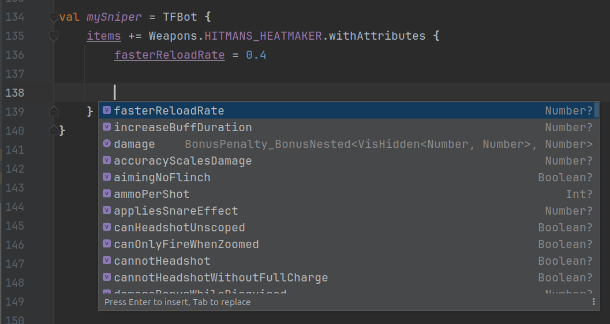
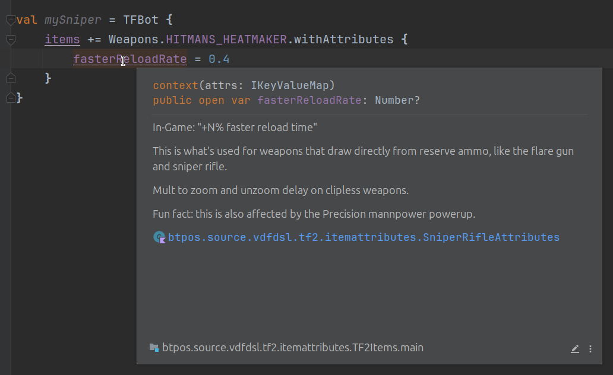
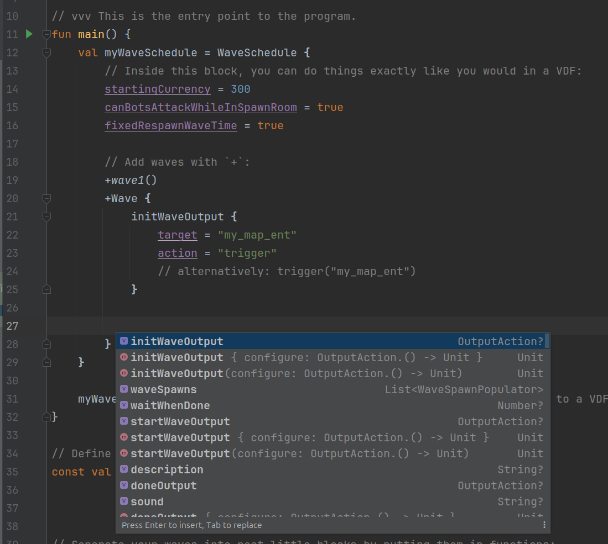

# How to Use:

```kotlin
// FILE: Main.kt

// (`main` is the entry point to a program)
fun main() {
	val myWaveSchedule = WaveSchedule {
		// Inside this block, you can do things exactly like you would in a VDF:
		startingCurrency = 300                  // StartingCurrency 300
		canBotsAttackWhileInSpawnRoom = false   // CanBotsAttackWhileInSpawnRoom no
		respawnWaveTime = 7                     // RespawnWaveTime no
        
        
		// Add waves or missions to the schedule with `+`:
		+wave1()
		+Wave {
			initWaveOutput {
				target = "my_map_ent"
				action = "trigger"
				// alternatively: trigger("my_map_ent")
			}
			
			// Declare and add a subwave
			+WaveSpawn(name="wave02a") {
				where = "spawnbot"      // Where spawnbot
				
				totalCount = 100        // TotalCount 100
				maxActive = 100         // MaxActive 100
				spawnCount = 20         // SpawnCount 20
				waitBetweenSpawns = 0   // WaitBetweenSpawns 0
				
				totalCurrency = 100
				
				// Set the spawner for this subwave
				+TFBot(name="Fish Scout") {
					`class` = TFClass.Scout
					skill = BotSkill.Hard
					
					attributes += TFBotAttributes.AlwaysCrit
					weaponRestriction = WeaponRestrictions.MeleeOnly
					
					items += WeaponsByClass.Scout.Melee.HOLY_MACKEREL {
						fireRate.bonus.visible = 30
					}
				}
			}
		}
	}
	
	myWaveSchedule.writeToFile("./my_popfile.pop") // <-- Writes everything to a VDF, exactly as if you'd written it by hand
}
```
## Utilities!

### Implicit subwave naming:
```kotlin
// Normal:
val mySubwave = WaveSpawn {
	name = "mySubwave"
}

// If you use `by`, it implicitly uses the name of the variable it's assigned to:
val mySubwave by WaveSpawn {
	// name = "mySubwave"
}
```

### Spawning macros:
```kotlin
val oneScoutAtATime = WaveSpawn {
	where = MAIN_SPAWN_LOCATION
    
    totalCount = 100
    trickleInEvery(0.25.seconds)    
    // MaxActive  <totalCount>
    // SpawnCount 1
    // WaitBetweenSpawns 0.25
    
    +EASY_SCOUT
}

val swarmOfFlies = WaveSpawn {
	where = MAIN_SPAWN_LOCATION
	
    totalCount = 100
    allAtOnce()
    // MaxActive <totalCount>
    // SpawnCount <totalCount>
    // WaitBetweenSpawns 0
    
	+FLYGINEER
}
```


### Automatic subwave timing:

```kotlin
val wave7 = WaveBuilder {
	val huntsmenWithMedics by WaveSpawn {
		where = MAIN_SPAWN_LOCATION
		
		totalCount = 30
		allAtOnce()
		
		totalCurrency = 300
		
		+Squad {
			+TFBot(template = RobotStandardTemplates.Sniper.HUNTSMAN) {
				addAttributesForExisting(Weapons.HUNTSMAN) {
					damage.bonus.visible = 0.075f
					fasterReloadRate = 0.4f
				}
			}
			+TFBot(template = RobotStandardTemplates.Medic.QUICKUBER)
		}
	}
	
	val sendInTheGnomes by WaveSpawn {
		where = MAIN_SPAWN_LOCATION
		
		spawn(54) inGroupsOf 6 waitingBetweenSpawns 5.seconds
		
		+TFBot(template = RobotStandardTemplates.Heavyweapons.GNOME)
	}
	
	+huntsmenWithMedics
	waitForAllDead(huntsmenWithMedics)
	wait(2.seconds)
	+sendInTheGnomes // Adds `WaitForAllDead "huntsmenWithMedics"` and `Wait 2`
}
```

## Items

This is the part that took the longest: **every single item and item attribute in TF2 has a constant value**.

NO. MORE. TYPOS.

```kotlin
val myBot = TFBot {
	items += Weapons.HITMANS_HEATMAKER
	items += Cosmetics.STOUT_SHAKO
}
```

### **EVERY WEAPON KNOWS WHAT ATTRIBUTES IT CAN USE.**

I went through the SDK and found every usage of every single attribute in the entire game.

When you call `withAttributes`, you only have access to the attributes that will work on that weapon within that block.

```kotlin
val mySniper = TFBot {
	items += Weapons.HITMANS_HEATMAKER.withAttributes {
		fasterReloadRate = 0.4
	}
}
```




## Advanced

Since this is in a programming language, you can go all-out with custom utilities.

### Define constants: Change once, change everywhere!
```kotlin
const val MAIN_SPAWN_LOCATION = "spawnbot"
```

### Sort your code by putting each wave in its own section!
```kotlin
fun wave1(): WavePopulator {
	return Wave {
		// ...
	}
}

// Note: You can also use `=` to make a function immediately return whatever goes after the equals sign:
fun wave1() = Wave {
	// ...
}
```

### Make subwaves from default settings, no matter how complex!
```kotlin
inline fun tankSubWave(health: Int, speed: Number, additionalConfiguration: WaveSpawnPopulator.() -> Unit) = WaveSpawn {
	firstSpawnOutput = OutputAction {
		trigger("boss_spawn_relay")
	}
	
	additionalConfiguration()
	
	+Tank {
		this.health = health
		this.speed = speed
		this.name = "tankboss"
		this.startingPathTrackNode = "boss_path_a1"
		
		onKilledOutput = OutputAction {
			trigger("boss_dead_relay")
		}
		onBombDroppedOutput = OutputAction {
			trigger("boss_deploy_relay")
		}
	}
}

val tanksEvery30seconds = tankSubWave(health=20_000, speed=75) {
	totalCount = 10
	spawnEvery(30.seconds)
	totalCurrency = 500
}
```

## Because it's in an IDE, you can also:

### Get documentation with a single button press:




### Press CTRL+SPACE to get contextual suggestions:


### Rename things everywhere with a single button press:


# How to Install

## Development Environment

First, you'll want to use [IntelliJ IDEA](https://www.jetbrains.com/idea/download/).  It's totally free, runs great even on a potato, and is by far the best IDE I've ever used for _any_ language.  It's also the main reason Kotlin is such a delight to program in.

(Once you have that installed, you'll want to go to "Plugins > Installed" and disable all of their LLM bullshit, primarily Full Line Code Completion.  Even if you're one of those people who shills for AI, having something look over your shoulder and go "did you mean THIS" every time you try to write anything is the best way to lose your train of thought.)

## Project

Open IntelliJ and click "New Project".  Create a Kotlin project, but make sure it's set up to use **Gradle** as its build tool.

Once it's set up, go to `build.gradle.kts` and:
- Add the line `maven(url="https://jitpack.io")` to the `repositories` block,
- Add the line `implementation("com.github.ByThePowerOfScience:TF2-MvM-Popfile-Maker:v1.0-beta.+")` to the `dependencies` block.
- Click the little elephant/refresh icon floating in the top right corner.


# Credits
- Sigsegv: [sigsegv's MvM Population KeyValues Documentation](https://gist.github.com/sigsegv-mvm/9ce39744fde2aa4c6156)
- The wonderful people on the Potato.tf discord
